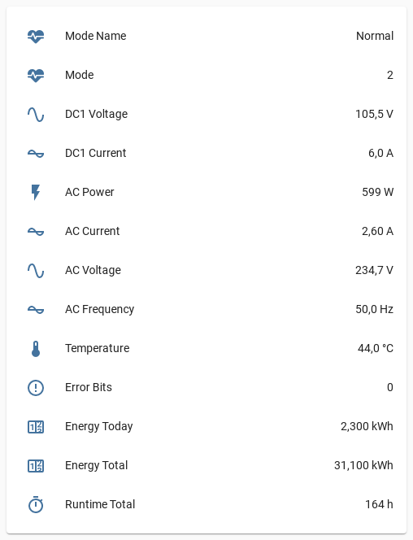

# esphome-modbus-solax-x1


[](https://www.buymeacoffee.com/syssi)

ESPHome component to monitor a Solax X1 mini via RS485.



## Supported devices

* Solax X1 Mini
* Solax X1 Mini G2

## Requirements

* [ESPHome 1.18.0 or higher](https://github.com/esphome/esphome/releases).
* One half of an ethernet cable with rj45 connector
* RS485-to-TTL module (`HW-0519` f.e.)
* Generic ESP32 or ESP8266 board

## Schematics

```
               RS485                      UART
┌─────────┐              ┌──────────┐                ┌─────────┐
│         │              │          │<----- RX ----->│         │
│  Solax  │<-----B- ---->│  RS485   │<----- TX ----->│ ESP32/  │
│ X1 Mini │<---- A+ ---->│  to TTL  │<----- GND ---->│ ESP8266 │
│         │<--- GND ---->│  module  │<--- 5V VCC --->│         │<-- 5V VCC
│         │              │          │                │         │<-- GND
└─────────┘              └──────────┘                └─────────┘
```

### X1 Min RJ45 jack

| Pin     | Purpose      | RS485-to-TTL pin  | Color T-568B |
| :-----: | :----------- | :---------------- | ------------ |
|    1    | RefGen       |                   |              |
|    2    | Com/DRM0     |                   |              |
|    3    | GND_COM      |                   |              |
|    4    | **A+**       | **A+**            | Blue         |
|    5    | **B-**       | **B-**            | Blue-White   |
|    6    | E_Stop       |                   |              |
|    7    | **GND_COM**  | **GND**           | Brown-White  |
|    8    | --           |                   |              |

## Installation

You can install this component with [ESPHome external components feature](https://esphome.io/components/external_components.html) like this:
```yaml
external_components:
  - source: github://syssi/esphome-modbus-solax-x1@main
```

or just use the `esp32-example.yaml` / `esp8266-example.yaml` as proof of concept:

```bash
# Install esphome
pip3 install esphome

# Clone this external component
git clone https://github.com/syssi/esphome-modbus-solax-x1.git
cd esphome-modbus-solax-x1

# Create a secrets.yaml containing some setup specific secrets
cat > secrets.yaml <<EOF
wifi_ssid: MY_WIFI_SSID
wifi_password: MY_WIFI_PASSWORD

mqtt_host: MY_MQTT_HOST
mqtt_username: MY_MQTT_USERNAME
mqtt_password: MY_MQTT_PASSWORD
EOF

# Validate the configuration, create a binary, upload it, and start logs
# If you use a esp8266 run the esp8266-examle.yaml
esphome run esp32-example.yaml

```

## Configuration

```yaml
substitutions:
  name: solar-powermeter

esphome:
  name: ${name}
  platform: ESP32
  board: esp-wrover-kit

external_components:
  - source: github://syssi/esphome-modbus-solax-x1@main
    refresh: 0s

wifi:
  ssid: !secret wifi_ssid
  password: !secret wifi_password

ota:
# api:

logger:
  baud_rate: 0

mqtt:
  broker: !secret mqtt_host
  username: !secret mqtt_username
  password: !secret mqtt_password
  id: mqtt_client

uart:
  baud_rate: 9600
  tx_pin: GPIO1
  rx_pin: GPIO3

solax_x1:
  serial_number: "3132333435363737363534333231"
  address: 0x0A
  update_interval: 1s

text_sensor:
  - platform: solax_x1
    mode_name:
      name: "${name} mode name"
    errors:
      name: "${name} errors"

sensor:
  - platform: solax_x1
    ac_power:
      name: "${name} ac power"
    energy_today:
      name: "${name} energy today"
    energy_total:
      name: "${name} energy total"
    dc1_voltage:
      name: "${name} dc1 voltage"
    dc2_voltage:
      name: "${name} dc2 voltage"
    dc1_current:
      name: "${name} dc1 current"
    dc2_current:
      name: "${name} dc2 current"
    ac_current:
      name: "${name} ac current"
    ac_voltage:
      name: "${name} ac voltage"
    ac_frequency:
      name: "${name} ac frequency"
    temperature:
      name: "${name} temperature"
    runtime_total:
      name: "${name} runtime total"
    mode:
      name: "${name} mode"
    error_bits:
      name: "${name} error bits"
```

For a more advanced setup take a look at the [esp32-example-advanced-multiple-uarts.yaml](esp32-example-advanced-multiple-uarts.yaml).

## Known issues

All known firmware versions (`V1.00`) responds with the same serial number (`3132333435363737363534333231`) to the discovery 
broadcast (`AA.55.01.00.00.00.10.00.00.01.10`). For this reason it's challenging to use multiple devices on the same bus and 
assign an individual address per device.

Affected firmware versions:

* 618.00207.00_X1_BOOST3.0_MINI2.0_AIR2.0_ARM_V1.32_20210625.usb, 618.00381.00_X1_BOOST3.0_MINI2.0_AIR2.0_DSP_V2.12_20210622.usb

Workaround: Use one UART per device to handle multiple devices.


## Protocol details

### Discovery

```
# Send discovery to broadcast address (0x10 0x00)
[VV][modbus_solax:200]: TX -> AA.55.01.00.00.00.10.00.00.01.10 (11)
[VV][modbus_solax:084]: RX <- AA.55.00.FF.01.00.10.80.0E.31.32.33.34.35.36.37.37.36.35.34.33.32.31.05.75 (25)
                                                         ^^^^^^^^^^^^^^^^^^^^^^^^^^^^^^^^^^^^^^^^^
[I][modbus_solax:105]: Inverter discovered. Serial number: 3132333435363737363534333231

# Assign address (0x0A) to the inverter via serial number (0x10, 0x01)
[VV][modbus_solax:200]: TX -> AA.55.00.00.00.00.10.01.0F.31.32.33.34.35.36.37.37.36.35.34.33.32.31.0A.04.01 (26)
                                                         ^^^^^^^^^^^^^^^^^^^^^^^^^^^^^^^^^^^^^^^^^^^^
                                                   Byte   0  1  2  3  4  5  6  7  8  9 10 11 12 13 14

# Register address confirmation (0x10, 0x81)
[VV][modbus_solax:084]: RX <- AA.55.00.0A.00.00.10.81.01.06.01.A1 (12)
                                                    ^
                                                    ACK
```

### Request device infos

```
# Request info (0x11 0x03)
[18:13:12][VV][modbus_solax:214]: TX -> AA.55.01.00.00.0A.11.03.00.01.1E (11)

# Response (0x11 0x83)
[18:13:12][VV][modbus_solax:084]: RX <- AA.55.00.0A.01.00.11.83.3A.01.00.00.00.00.00.00.56.31.2E.30.30.20.20.20.20.20.20.20.20.20.20.20.20.20.20.73.6F.6C.61.78.20.20.20.20.20.20.20.20.20.58.4D.55.30.36.32.47.43.30.39.33.35.34.30.33.36.30.30.0C.0F (69)
                                                                   ^^^^^^^^^^^^^^^^^^^^^^^^^^^^^^^^^^^^^^^^^^^^^^^^^^^^^^^^^^^^^^^^^^^^^^^^^^^^^^^^^^^^^^^^^^^^^^^^^^^^^^^^^^^^^^^^^^^^^^^^^^^^^^^^^^^^^^^^^^^^^^^^^^^^^^^^^^^^^^^^^^^^^^^^^^^^^

Data  0      (device type?):      0x01 (single phase)
Data  1...6  (rated power):       0x00 0x00 0x00 0x00 0x00 0x00 ()
Data  7...11 (firmware version):  0x56 0x31 0x2E 0x30 0x30 (V1.00)
Data 12...25 (module name):       0x20 0x20 0x20 0x20 0x20 0x20 0x20 0x20 0x20 0x20 0x20 0x20 0x20 0x20 ( )
Data 26...39 (factory name):      0x73 0x6F 0x6C 0x61 0x78 0x20 0x20 0x20 0x20 0x20 0x20 0x20 0x20 0x20 (solax )
Data 40...53 (serial number):     0x58 0x4D 0x55 0x30 0x36 0x32 0x47 0x43 0x30 0x39 0x33 0x35 0x34 0x30 (XMU062GC093540)
Data 54...57 (rated bus voltage): 0x33 0x36 0x30 0x30 (3600)
```

### Request live data

```
# Request live data (0x11 0x02)
[18:15:15][VV][modbus_solax:214]: TX -> AA.55.01.00.00.0A.11.02.00.01.1D (11)

# Response (0x11 0x82)
[18:15:15][VV][modbus_solax:214]: RX <-
AA.55.00.0A.01.00.11.82.34.00.19.00.01.02.46.00.00.00.0A.00.00.00.05.09.13.13.87.00.32.FF.FF.00.00.00.11.00.00.00.14.00.02.00.00.00.00.00.00.00.00.00.00.00.00.00.00.00.00.00.00.02.D0.06.21 (63)
                           ^^^^^^^^^^^^^^^^^^^^^^^^^^^^^^^^^^^^^^^^^^^^^^^^^^^^^^^^^^^^^^^^^^^^^^^^^^^^^^^^^^^^^^^^^^^^^^^^^^^^^^^^^^^^^^^^^^^^^^^^^^^^^^^^^^^^^^^^^^^^^^^^^^^^^^^^^^^

Data  0...1  (temperature):        0x00 0x19 (25 C)
Data  2...3  (energy today):       0x00 0x01 (0.1 kWh)
Data  4...5  (pv1 voltage):        0x02 0x46 (58.2 V)
Data  6...7  (pv2 voltage):        0x00 0x00 (0.0 V)
Data  8...9  (pv1 current):        0x00 0x0A (1.0 A)
Data 10...11 (pv2 current):        0x00 0x00 (0.0 A)
Data 12...13 (ac current):         0x00 0x05 (0.5 A)
Data 14...15 (ac voltage):         0x09 0x13 (232.3V)
Data 16...17 (ac frequency):       0x13 0x87 (49.99 Hz)
Data 18...19 (ac power):           0x00 0x32 (50 W)
Data 20...21 (unused):             0xFF 0xFF
Data 22...25 (energy total):       0x00 0x00 0x00 0x11 (0.1 kWh)
Data 26...29 (runtime total):      0x00 0x00 0x00 0x14 (20 h)
Data 30...31 (mode):               0x00 0x02 (2: Normal)
Data 32...33 (grid voltage fault): 0x00 0x00 (0.0 V)
Data 34...35 (grid freq. fault)    0x00 0x00 (0.00 Hz)
Data 36...37 (dc injection fault): 0x00 0x00 (0 mA)
Data 38...39 (temperature fault):  0x00 0x00
Data 40...41 (pv1 voltage fault):  0x00 0x00
Data 42...43 (pv2 voltage fault):  0x00 0x00
Data 44...45 (gfc fault):          0x00 0x00
Data 46...49 (error message):      0x00 0x00 0x00 0x00
Data 50...52 (unknown):            0x02 0xD0

```

## References

* https://github.com/JensJordan/solaXd/
* https://github.com/arendst/Tasmota/blob/development/tasmota/xnrg_12_solaxX1.ino
* https://github.com/esphome/esphome/blob/dev/esphome/components/modbus/modbus.cpp
* https://github.com/syssi/esphome-modbus-solax-x1/blob/main/docs/SolaxPower_Single_Phase_External_Communication_Protocol_-_X1_Series_V1.2.pdf
